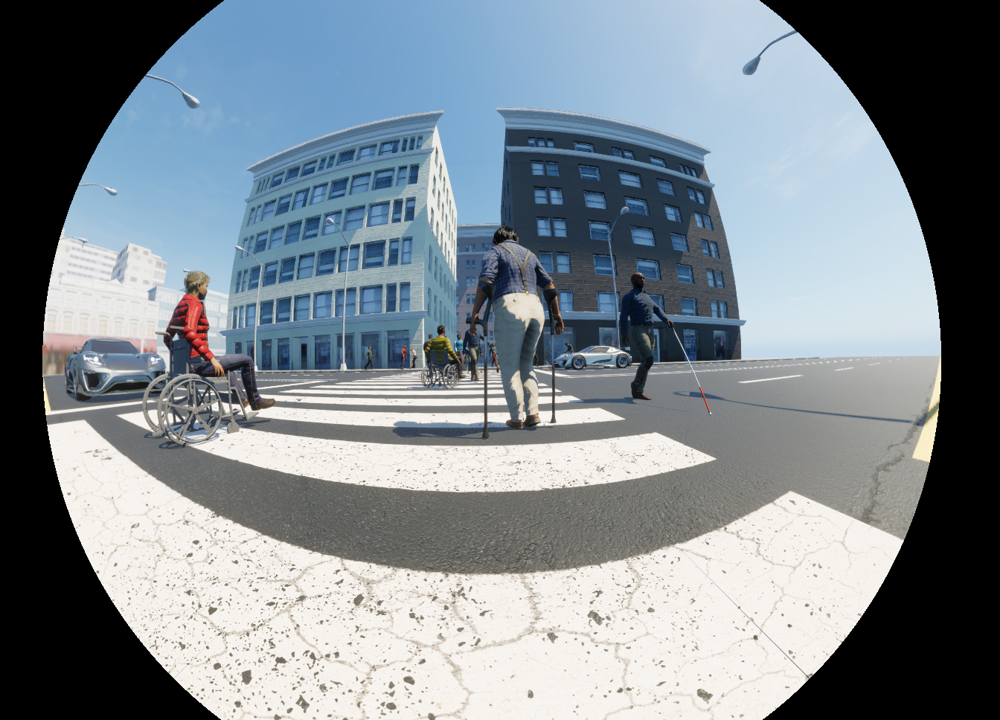

# DiverSim

**DiverSim** is an innovative simulating tool to generate **synthetic pedestrian data** with a focus on **diversity** and inclusion. Built on Unreal Engine 5, DiverSim creates balanced datasets featuring equal proportions of **genders, ethnicities**, and individuals with **disabilities**. Users can customize various simulation parameters, including atmospheric conditions, **fisheye camera** parameters and characteristics of the pedestrians, while data is annotated in **ASAM OpenLABEL** format. As an open-source tool, DiverSim enables researchers and developers to train and validate AI models that effectively represent diverse pedestrian scenarios.

## How To Use
To understand how to perform a recording with the DiverSim tool, please refer to the *example_record.py* script. This script outlines the essential simulation parameters, specifies the path to the executable (see links below), and designates the save location for the output data. It effectively manages the execution of the simulator, configures the simulation settings, and captures and annotates the generated data.

## Licensing
All the assets and animations used in this simulator have been carefully chosen so that their licenses allow their use for AI training and validation purposes.

The licensing of DiverSim is subject to the **Unreal Engine End User License Agreement (EULA)**. Please refer to the Unreal Engine EULA for specific details regarding the usage and distribution of the simulator. The EULA sets the terms and conditions for using Unreal Engine and any content generated using it, including this tool.

As a user of DiverSim, it is your responsibility to comply with the terms specified in the Unreal Engine EULA. Ensure that you read and understand the EULA before using this simulator for any purpose.

## Atributions
DiverSim was generated employing the AirSim Simulator on Unreal Engine 5 as part of the European project AWARE2ALL.

## Citation
If you use DiverSim in your research, publications, or academic work, please cite this Github repository.

## Contact
For any questions or inquiries regarding the RailSceneSet dataset, please contact jainiguez@vicomtech.org or mhormaetxea@vicomtech.org.

## Download links
You can download the simulator executable here:
[https://opendatasets.vicomtech.org/di21-diversim/ceb2d330](https://opendatasets.vicomtech.org/di21-diversim/ceb2d330)
